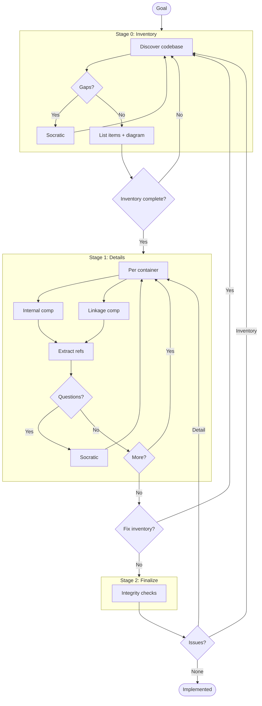
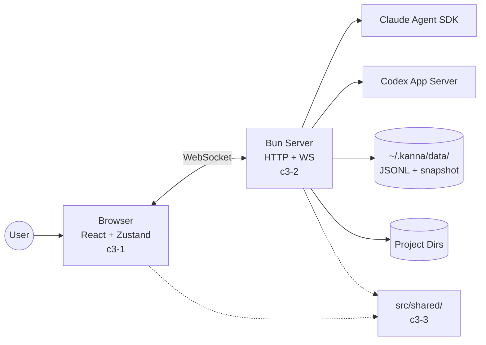

# C3 Architecture Documentation Adoption
## Goal

Adopt C3 methodology for kanna.

<!--
EXIT CRITERIA (all must be true to mark implemented):
- All containers documented with Goal Contribution
- All components documented with Container Connection
- Refs extracted for repeated patterns
- Integrity checks pass
- Audit passes
-->
## Workflow

---
## Stage 0: Inventory

### Context Discovery

| Arg | Value |
|-----|-------|
| PROJECT | Kanna |
| GOAL | Beautiful browser UI for Claude Code + Codex CLIs with project-first navigation, multi-provider agent coordination, and event-sourced local persistence |
| SUMMARY | Bun+React app driving Claude Agent SDK and Codex App Server over WebSocket, persisting state as append-only JSONL, rendering hydrated tool calls in real time |

### Abstract Constraints

| Constraint | Rationale | Affected Containers |
|------------|-----------|---------------------|
| Event sourcing for all state mutations | Replayable history, crash-safe, debuggable audit trail | c3-2 |
| CQRS: write (events) decoupled from read (derived models) | UI subscribes to fast snapshots without touching the log | c3-1, c3-2 |
| Reactive WebSocket broadcasting on every state change | Multiple tabs and agents stay consistent in real time | c3-1, c3-2 |
| Local-first: data under ~/.kanna/data, default bind localhost | Zero server infra, user owns data, safe by default | c3-2 |
| Provider-agnostic agent coordination (Claude + Codex) | Per-turn provider/model/effort picks without forking transcript model | c3-1, c3-2 |
| Strong TypeScript typing — no any at boundaries | Client + server agree on protocol + events | c3-1, c3-2, c3-3 |

### Container Discovery

| N | CONTAINER_NAME | BOUNDARY | GOAL | SUMMARY |
|---|----------------|----------|------|---------|
| 1 | client | app | Render chat, accept input, subscribe to WS pushes | React + Zustand SPA under src/client |
| 2 | server | service | Drive agents, persist events, broadcast snapshots | Bun HTTP+WS runtime under src/server |
| 3 | shared | library | Publish wire protocol + domain types used by both sides | Code under src/shared imported by client and server |

### Component Discovery (Brief)

| N | NN | COMPONENT_NAME | CATEGORY | GOAL | SUMMARY |
|---|----|--------------  |----------|------|---------|
| 1 | 01 | socket-client | foundation | Connect WS, route messages, emit commands | src/client/app/socket.ts |
| 1 | 02 | state-stores | foundation | Zustand stores for chat/terminal/sidebar/prefs | src/client/stores/* |
| 1 | 03 | ui-primitives | foundation | Radix + shadcn primitives (button, dialog, popover...) | src/client/components/ui/* |
| 1 | 10 | app-shell | feature | Router, top-level page hookup, central state hook | src/client/app/App.tsx + useKannaState.ts |
| 1 | 11 | sidebar | feature | Project-first sidebar with drag ordering, jump shortcuts | src/client/app/KannaSidebar.tsx |
| 1 | 12 | chat-page | feature | Chat route shell: transcript viewport + input dock + terminal | src/client/app/ChatPage/* |
| 1 | 13 | transcript | feature | Render hydrated transcript entries | src/client/app/KannaTranscript.tsx |
| 1 | 14 | messages-renderer | feature | Render each transcript entry type (tool calls, text, diffs) | src/client/components/messages/* |
| 1 | 15 | chat-ui-chrome | feature | Input, composer controls, provider/model pickers | src/client/components/chat-ui/* |
| 1 | 16 | settings-page | feature | Settings dialogs and preferences | src/client/app/SettingsPage.tsx |
| 1 | 17 | local-projects-page | feature | List/open locally discovered projects | src/client/app/LocalProjectsPage.tsx |
| 1 | 18 | terminal-workspace | feature | Embedded xterm panel + layout animation | src/client/app/ChatPage/TerminalWorkspaceShell.tsx |
| 2 | 01 | cli-entry | foundation | CLI parsing, supervisor, runtime, browser launcher | src/server/cli*.ts |
| 2 | 02 | http-ws-server | foundation | HTTP + WebSocket server, static serving, auth hookup | src/server/server.ts |
| 2 | 03 | auth | foundation | Password gate + session cookie for API/WS | src/server/auth.ts |
| 2 | 04 | paths-config | foundation | Data paths, machine name, branding helpers | src/server/paths.ts + machine-name.ts |
| 2 | 05 | events-schema | foundation | Event type definitions for JSONL logs | src/server/events.ts |
| 2 | 06 | event-store | foundation | Append-only JSONL with replay + snapshot compaction | src/server/event-store.ts |
| 2 | 07 | read-models | foundation | Derive sidebar/chat/project views from event state | src/server/read-models.ts |
| 2 | 08 | ws-router | foundation | Subscribe/command routing over WebSocket | src/server/ws-router.ts |
| 2 | 09 | process-utils | foundation | Process spawning + lifecycle helpers | src/server/process-utils.ts |
| 2 | 10 | agent-coordinator | feature | Multi-provider turn management | src/server/agent.ts |
| 2 | 11 | codex-app-server | feature | JSON-RPC client for Codex App Server | src/server/codex-app-server*.ts |
| 2 | 12 | provider-catalog | feature | Provider/model/effort normalization | src/server/provider-catalog.ts |
| 2 | 13 | quick-response | feature | Structured Haiku queries with Codex fallback (titles, commits) | quick-response.ts + generate-title.ts + generate-commit-message.ts + llm-provider.ts |
| 2 | 14 | discovery | feature | Auto-discover Claude + Codex local projects | src/server/discovery.ts |
| 2 | 15 | diff-store | feature | Per-chat diff state for hydrated file-change UI | src/server/diff-store.ts |
| 2 | 16 | terminal-manager | feature | PTY sessions for embedded terminal | src/server/terminal-manager.ts |
| 2 | 17 | uploads | feature | File uploads + attachment handling | src/server/uploads.ts |
| 2 | 18 | share | feature | Cloudflare quick-tunnel + named tunnel + QR | src/server/share.ts |
| 2 | 19 | update-manager | feature | Self-update notifications | src/server/update-manager.ts |
| 2 | 20 | restart | feature | In-place restart flow | src/server/restart.ts |
| 2 | 21 | external-open | feature | Open URLs/files in external apps | src/server/external-open.ts |
| 2 | 22 | keybindings | feature | User keybinding persistence | src/server/keybindings.ts |
| 3 | 01 | types | foundation | Core domain types, provider catalog, transcript entry types | src/shared/types.ts |
| 3 | 02 | protocol | foundation | WebSocket wire protocol shapes | src/shared/protocol.ts |
| 3 | 03 | tools | foundation | Tool call normalization + hydration | src/shared/tools.ts |
| 3 | 04 | ports | foundation | Port allocation + dev-port helpers | src/shared/ports.ts + dev-ports.ts |
| 3 | 05 | branding | foundation | App name + data dir paths | src/shared/branding.ts |
| 3 | 06 | share-shared | foundation | Share feature types shared with client | src/shared/share.ts |

### Ref Discovery

| SLUG | TITLE | GOAL | Scope | Applies To |
|------|-------|------|-------|------------|
| ref-event-sourcing | Event Sourcing | All mutations go through append-only JSONL; readers replay | cross-container | c3-2 event-store, events-schema, read-models |
| ref-cqrs-read-models | CQRS Read Models | Derive view models from event state; broadcast diffs | cross-container | c3-1 state-stores, c3-2 read-models + ws-router |
| ref-ws-subscription | WebSocket Subscription | Single WS with typed subscribe/command envelope | cross-container | c3-1 socket-client, c3-2 ws-router, c3-3 protocol |
| ref-provider-adapter | Provider Adapter | Normalize Claude Agent SDK and Codex into one transcript model | cross-container | c3-2 agent-coordinator, provider-catalog, codex-app-server, quick-response |
| ref-zustand-store | Zustand Store Pattern | Per-concern store, persist via localStorage as needed | client | c3-1 state-stores |
| ref-colocated-bun-test | Colocated Bun Test | *.test.ts next to impl, runs under `bun test` | cross-container | all |
| ref-strong-typing | Strong Typing Policy | No any/unknown at boundaries; prefer shared types | cross-container | all |
| ref-local-first-data | Local-First Data | All persistence under ~/.kanna/data; localhost-default binding | server | c3-2 event-store, paths-config |
| ref-tool-hydration | Tool Call Hydration | Normalize provider tool calls into unified transcript entries | cross-container | c3-3 tools, c3-1 messages-renderer, c3-2 agent-coordinator |

### Overview Diagram

### Gate 0

- [x] Context args filled
- [x] Abstract Constraints identified
- [x] All containers identified with args (including BOUNDARY)
- [x] All components identified (brief) with args and category
- [x] Cross-cutting refs identified
- [x] Overview diagram generated
## Stage 1: Details

<!--
Fill in each container with its components.
- Internal: components that are self-contained
- Linkage: components that handle connections to other containers
- Extract refs when patterns repeat
- If new item found -> back to Stage 0
-->

### Container: c3-1

**Created:** [ ] `.c3/c3-1-{slug}/README.md`

| Type | Component ID | Name | Category | Doc Created |
|------|--------------|------|----------|-------------|
| Internal | | | | [ ] |
| Linkage | | | | [ ] |

### Container: c3-N

_(repeat per container from Stage 0)_

### Refs Created

| Ref ID | Pattern | Doc Created |
|--------|---------|-------------|
| | | [ ] |

### Gate 1

- [ ] All container README.md created
- [ ] All component docs created
- [ ] All refs documented
- [ ] No new items discovered (else -> Gate 0)

---
## Stage 2: Finalize

<!--
Integrity checks - verify everything connects.
If issues found -> back to appropriate stage.
-->

### Integrity Checks

| Check | Status |
|-------|--------|
| Context <-> Container (all containers listed in c3-0) | [ ] |
| Container <-> Component (all components listed in container README) | [ ] |
| Component <-> Component (linkages documented) | [ ] |
| * <-> Refs (refs cited correctly, Cited By updated) | [ ] |

### Gate 2

- [ ] All integrity checks pass
- [ ] Run audit

---
## Conflict Resolution

If later stage reveals earlier errors:

| Conflict | Found In | Affects | Resolution |
|----------|----------|---------|------------|
| | | | |

---
## Exit

When Gate 2 complete -> change frontmatter status to `implemented`
## Audit Record

| Phase | Date | Notes |
|-------|------|-------|
| Adopted | 20260420 | Initial C3 structure created |
