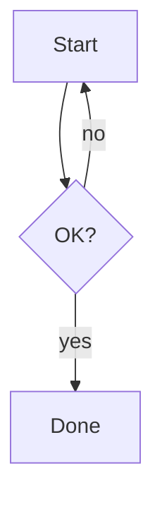

# Mermaid Diagram Rendering Implementation Plan

> **For agentic workers:** REQUIRED SUB-SKILL: Use superpowers:subagent-driven-development (recommended) or superpowers:executing-plans to implement this plan task-by-task. Steps use checkbox (`- [ ]`) syntax for tracking.

**Goal:** Render ` ```mermaid ` fenced code blocks as live diagrams in all transcript markdown, with lazy loading, strict sanitization, theme sync, and silent code-block fallback.

**Architecture:** A new lazy-loaded `MermaidDiagram` React component is returned from the existing `code` markdown override in `src/client/components/messages/shared.tsx` when the fence language is `mermaid`. Mermaid (v11) is dynamically `import()`-ed once per session, rendered with `securityLevel: "strict"`, themed from `useTheme().resolvedTheme`, and falls back to the normal code block on any failure.

**Tech Stack:** React 19, react-markdown v10, `mermaid` ^11.15.0 (lazy), Tailwind, `bun:test` + happy-dom.

**Pre-existing note:** Baseline has a flaky test (1/2 clean-baseline runs failed, identity unknown, unrelated to this work). Treat baseline as green (0 fail on rerun). If the same flake appears during this plan, re-run once to confirm it is the flake and not a regression before proceeding.

**Spec:** `docs/superpowers/specs/2026-05-19-mermaid-diagram-render-design.md`

---

## File Structure

- Create: `src/client/components/messages/MermaidDiagram.tsx` — the diagram component (load, render, theme, error fallback, view-source toggle, copy, zoom trigger).
- Create: `src/client/components/messages/MermaidZoomModal.tsx` — fullscreen pan/zoom modal for a rendered SVG.
- Create: `src/client/components/messages/MermaidDiagram.test.tsx` — component tests.
- Create: `src/client/components/messages/MermaidZoomModal.test.tsx` — modal tests.
- Modify: `src/client/components/messages/shared.tsx` — `code` override detects `language-mermaid`; export a `MermaidFallbackCodeBlock` used by both the override and the component.
- Modify: `src/client/components/messages/shared.test.tsx` — assert override routes mermaid to the component.
- Modify: `package.json` — add `mermaid` dependency.

---

## Task 0: C3 context load (no code)

**Files:** none.

- [ ] **Step 1: Load component context**

Run: `/c3 query transcript message markdown rendering shared.tsx`
Expected: prints the messages/transcript component refs + rules. Read them. Confirm no rule forbids new components in `src/client/components/messages` and note the render-loop rule (stable selector refs).

- [ ] **Step 2: No commit** (read-only).

---

## Task 1: Add mermaid dependency

**Files:**
- Modify: `package.json`

- [ ] **Step 1: Add the dependency**

Run: `bun add mermaid@^11.15.0`
Expected: `package.json` `dependencies` gains `"mermaid": "^11.15.0"`, `bun.lock` updated.

- [ ] **Step 2: Verify it is importable but not eagerly bundled**

Run: `bun -e "import('mermaid').then(m=>console.log(typeof m.default.render))"`
Expected: prints `function`.

- [ ] **Step 3: Commit**

```bash
git add package.json bun.lock
git commit -m "build: add mermaid dependency (lazy-loaded)"
```

---

## Task 2: MermaidFallbackCodeBlock (shared, exported)

A plain code-block renderer matching the existing non-inline `code` styling, used as the failure fallback and the view-source body. Extracted so the component and the override stay DRY.

**Files:**
- Modify: `src/client/components/messages/shared.tsx`
- Test: `src/client/components/messages/shared.test.tsx`

- [ ] **Step 1: Write the failing test**

Add to `src/client/components/messages/shared.test.tsx`:

```tsx
import { MermaidFallbackCodeBlock } from "./shared"

test("MermaidFallbackCodeBlock renders source inside a pre/code block", () => {
  const html = renderToStaticMarkup(
    <MermaidFallbackCodeBlock source={"graph TD\nA-->B"} />
  )
  expect(html).toContain("<pre")
  expect(html).toContain("graph TD")
  expect(html).toContain("A--&gt;B")
})
```

If `shared.test.tsx` lacks `renderToStaticMarkup`, add at top:
`import { renderToStaticMarkup } from "react-dom/server"`.

- [ ] **Step 2: Run test to verify it fails**

Run: `bun test src/client/components/messages/shared.test.tsx -t "MermaidFallbackCodeBlock"`
Expected: FAIL — `MermaidFallbackCodeBlock` is not exported.

- [ ] **Step 3: Implement**

In `src/client/components/messages/shared.tsx`, after `PreBlock` (after line ~300), add:

```tsx
export function MermaidFallbackCodeBlock({ source }: { source: string }) {
  return (
    <PreBlock>
      <code className="block text-xs whitespace-pre language-mermaid">{source}</code>
    </PreBlock>
  )
}
```

- [ ] **Step 4: Run test to verify it passes**

Run: `bun test src/client/components/messages/shared.test.tsx -t "MermaidFallbackCodeBlock"`
Expected: PASS.

- [ ] **Step 5: Commit**

```bash
git add src/client/components/messages/shared.tsx src/client/components/messages/shared.test.tsx
git commit -m "feat(messages): add MermaidFallbackCodeBlock shared helper"
```

---

## Task 3: MermaidDiagram — successful render

**Files:**
- Create: `src/client/components/messages/MermaidDiagram.tsx`
- Test: `src/client/components/messages/MermaidDiagram.test.tsx`

- [ ] **Step 1: Write the failing test**

Create `src/client/components/messages/MermaidDiagram.test.tsx`:

```tsx
import "../../lib/testing/setupHappyDom"
import { describe, expect, test, mock, afterEach } from "bun:test"
import { act } from "react"
import { createRoot, type Root } from "react-dom/client"

mock.module("../../hooks/useTheme", () => ({
  useTheme: () => ({ resolvedTheme: "light", theme: "light", setTheme: () => {} }),
}))
mock.module("mermaid", () => ({
  default: {
    initialize: () => {},
    render: async (_id: string, text: string) => {
      if (text.includes("INVALID")) throw new Error("parse error")
      return { svg: `<svg data-mermaid="1">${text}</svg>` }
    },
  },
}))

const { MermaidDiagram } = await import("./MermaidDiagram")

let root: Root | null = null
let container: HTMLDivElement | null = null

afterEach(async () => {
  await act(async () => { root?.unmount() })
  container?.remove()
  root = null
  container = null
})

async function renderAndSettle(node: React.ReactElement) {
  container = document.createElement("div")
  document.body.appendChild(container)
  await act(async () => {
    root = createRoot(container!)
    root.render(node)
  })
  // flush the lazy import().then + mermaid.render microtask chain
  await act(async () => { await new Promise((r) => setTimeout(r, 0)) })
}

describe("MermaidDiagram", () => {
  test("renders the mermaid SVG for valid source", async () => {
    await renderAndSettle(<MermaidDiagram source={"graph TD\nA-->B"} />)
    expect(container!.innerHTML).toContain("data-mermaid")
    expect(container!.innerHTML).toContain("<svg")
  })
})
```

- [ ] **Step 2: Run test to verify it fails**

Run: `bun test src/client/components/messages/MermaidDiagram.test.tsx -t "renders the mermaid SVG"`
Expected: FAIL — `./MermaidDiagram` module not found.

- [ ] **Step 3: Implement the component (minimal — render + theme + fallback skeleton)**

Create `src/client/components/messages/MermaidDiagram.tsx`:

```tsx
import { useEffect, useId, useState } from "react"
import { useTheme } from "../../hooks/useTheme"
import { MermaidFallbackCodeBlock } from "./shared"

interface MermaidModule {
  initialize: (config: {
    startOnLoad: boolean
    securityLevel: "strict"
    theme: "dark" | "default"
  }) => void
  render: (id: string, text: string) => Promise<{ svg: string }>
}

let mermaidPromise: Promise<MermaidModule> | null = null

function loadMermaid(): Promise<MermaidModule> {
  if (!mermaidPromise) {
    mermaidPromise = import("mermaid").then(
      (m) => (m as unknown as { default: MermaidModule }).default
    )
  }
  return mermaidPromise
}

type RenderState =
  | { status: "loading" }
  | { status: "ready"; svg: string }
  | { status: "error" }

export function MermaidDiagram({ source }: { source: string }) {
  const { resolvedTheme } = useTheme()
  const mermaidTheme: "dark" | "default" = resolvedTheme === "dark" ? "dark" : "default"
  const [state, setState] = useState<RenderState>({ status: "loading" })
  const rawId = useId()
  const domId = `mermaid-${rawId.replace(/[^a-zA-Z0-9_-]/g, "")}`

  useEffect(() => {
    let cancelled = false
    setState({ status: "loading" })
    loadMermaid()
      .then(async (mermaid) => {
        mermaid.initialize({
          startOnLoad: false,
          securityLevel: "strict",
          theme: mermaidTheme,
        })
        const { svg } = await mermaid.render(domId, source)
        if (!cancelled) setState({ status: "ready", svg })
      })
      .catch(() => {
        if (!cancelled) setState({ status: "error" })
      })
    return () => {
      cancelled = true
    }
  }, [source, mermaidTheme, domId])

  if (state.status === "error") {
    return <MermaidFallbackCodeBlock source={source} />
  }
  if (state.status === "loading") {
    return <MermaidFallbackCodeBlock source={source} />
  }
  return (
    <div
      className="my-3 flex justify-center overflow-x-auto"
      // mermaid output is DOMPurify-sanitized by securityLevel:"strict"
      dangerouslySetInnerHTML={{ __html: state.svg }}
    />
  )
}
```

- [ ] **Step 4: Run test to verify it passes**

Run: `bun test src/client/components/messages/MermaidDiagram.test.tsx -t "renders the mermaid SVG"`
Expected: PASS.

- [ ] **Step 5: Commit**

```bash
git add src/client/components/messages/MermaidDiagram.tsx src/client/components/messages/MermaidDiagram.test.tsx
git commit -m "feat(messages): MermaidDiagram renders SVG for valid source"
```

---

## Task 4: MermaidDiagram — invalid source falls back to code block

**Files:**
- Test: `src/client/components/messages/MermaidDiagram.test.tsx`

- [ ] **Step 1: Write the failing test**

Add inside the `describe("MermaidDiagram", ...)` block:

```tsx
test("falls back to a code block when mermaid render throws", async () => {
  await renderAndSettle(<MermaidDiagram source={"INVALID DIAGRAM"} />)
  expect(container!.innerHTML).toContain("<pre")
  expect(container!.innerHTML).toContain("INVALID DIAGRAM")
  expect(container!.innerHTML).not.toContain("data-mermaid")
})
```

- [ ] **Step 2: Run test to verify it passes**

Run: `bun test src/client/components/messages/MermaidDiagram.test.tsx -t "falls back to a code block"`
Expected: PASS (Task 3 already routes `error` → `MermaidFallbackCodeBlock`). If FAIL, fix the `.catch` branch before continuing.

- [ ] **Step 3: Commit**

```bash
git add src/client/components/messages/MermaidDiagram.test.tsx
git commit -m "test(messages): MermaidDiagram code-block fallback on parse error"
```

---

## Task 5: MermaidDiagram — theme mapping from useTheme

**Files:**
- Test: `src/client/components/messages/MermaidDiagram.test.tsx`
- Modify: `src/client/components/messages/MermaidDiagram.tsx`

- [ ] **Step 1: Write the failing test**

Replace the top-of-file `mock.module("mermaid", ...)` and `mock.module("../../hooks/useTheme", ...)` with capture-capable mocks:

```tsx
let lastInitTheme: string | null = null
let themeValue: "light" | "dark" = "light"

mock.module("../../hooks/useTheme", () => ({
  useTheme: () => ({ resolvedTheme: themeValue, theme: themeValue, setTheme: () => {} }),
}))
mock.module("mermaid", () => ({
  default: {
    initialize: (cfg: { theme: string }) => { lastInitTheme = cfg.theme },
    render: async (_id: string, text: string) => {
      if (text.includes("INVALID")) throw new Error("parse error")
      return { svg: `<svg data-mermaid="1">${text}</svg>` }
    },
  },
}))
```

Add test:

```tsx
test("passes mermaid theme 'dark' when resolvedTheme is dark", async () => {
  themeValue = "dark"
  await renderAndSettle(<MermaidDiagram source={"graph TD\nA-->B"} />)
  expect(lastInitTheme).toBe("dark")
  themeValue = "light"
})

test("passes mermaid theme 'default' when resolvedTheme is light", async () => {
  themeValue = "light"
  await renderAndSettle(<MermaidDiagram source={"graph TD\nA-->B"} />)
  expect(lastInitTheme).toBe("default")
})
```

- [ ] **Step 2: Run tests to verify they pass**

Run: `bun test src/client/components/messages/MermaidDiagram.test.tsx -t "theme"`
Expected: PASS (Task 3 already maps `resolvedTheme === "dark" ? "dark" : "default"`). If FAIL, correct the `mermaidTheme` mapping.

- [ ] **Step 3: Commit**

```bash
git add src/client/components/messages/MermaidDiagram.test.tsx
git commit -m "test(messages): MermaidDiagram theme maps to mermaid dark/default"
```

---

## Task 6: MermaidDiagram — view-source toggle + copy-source controls

**Files:**
- Modify: `src/client/components/messages/MermaidDiagram.tsx`
- Test: `src/client/components/messages/MermaidDiagram.test.tsx`

- [ ] **Step 1: Write the failing test**

Add to the describe block:

```tsx
test("view-source toggle swaps rendered SVG for raw source", async () => {
  await renderAndSettle(<MermaidDiagram source={"graph TD\nA-->B"} />)
  expect(container!.innerHTML).toContain("data-mermaid")
  const toggle = container!.querySelector('[aria-label="View diagram source"]') as HTMLButtonElement
  expect(toggle).not.toBeNull()
  await act(async () => { toggle.click() })
  expect(container!.innerHTML).toContain("<pre")
  expect(container!.innerHTML).not.toContain("data-mermaid")
})

test("has a copy-source control", async () => {
  await renderAndSettle(<MermaidDiagram source={"graph TD\nA-->B"} />)
  expect(container!.querySelector('[aria-label="Copy diagram source"]')).not.toBeNull()
})
```

- [ ] **Step 2: Run test to verify it fails**

Run: `bun test src/client/components/messages/MermaidDiagram.test.tsx -t "view-source toggle"`
Expected: FAIL — no toggle button.

- [ ] **Step 3: Implement the controls overlay**

Replace the success-state `return` in `MermaidDiagram.tsx` with a controlled wrapper. Update the imports line and the success/return section:

Imports (replace the existing import block at the top of the file):

```tsx
import { useEffect, useId, useState } from "react"
import { Check, Code2, Copy, Maximize2 } from "lucide-react"
import { Button } from "../ui/button"
import { cn } from "../../lib/utils"
import { useTheme } from "../../hooks/useTheme"
import { MermaidFallbackCodeBlock } from "./shared"
```

Add a `showSource` state next to the existing `state` state:

```tsx
  const [showSource, setShowSource] = useState(false)
  const [copied, setCopied] = useState(false)

  const handleCopy = async () => {
    await navigator.clipboard.writeText(source)
    setCopied(true)
    setTimeout(() => setCopied(false), 2000)
  }
```

Replace the final `return (...)` (the success path) with:

```tsx
  if (showSource) {
    return (
      <div className="relative group/mermaid">
        <MermaidFallbackCodeBlock source={source} />
        <MermaidControls
          showSource={showSource}
          onToggleSource={() => setShowSource((v) => !v)}
          onCopy={handleCopy}
          copied={copied}
          onZoom={undefined}
        />
      </div>
    )
  }

  return (
    <div className="relative group/mermaid my-3">
      <div
        className="flex justify-center overflow-x-auto"
        dangerouslySetInnerHTML={{ __html: state.svg }}
      />
      <MermaidControls
        showSource={showSource}
        onToggleSource={() => setShowSource((v) => !v)}
        onCopy={handleCopy}
        copied={copied}
        onZoom={undefined}
      />
    </div>
  )
}

function MermaidControls({
  showSource,
  onToggleSource,
  onCopy,
  copied,
  onZoom,
}: {
  showSource: boolean
  onToggleSource: () => void
  onCopy: () => void
  copied: boolean
  onZoom?: () => void
}) {
  return (
    <div className="absolute top-1.5 right-1.5 flex gap-1 opacity-100 md:opacity-0 md:group-hover/mermaid:opacity-100 transition-opacity [@media(hover:none)]:!opacity-100">
      {onZoom && !showSource && (
        <Button
          variant="ghost"
          size="icon"
          aria-label="Zoom diagram"
          className="h-8 w-8 rounded-md text-muted-foreground hover:text-foreground"
          onClick={onZoom}
        >
          <Maximize2 className="h-4 w-4" />
        </Button>
      )}
      <Button
        variant="ghost"
        size="icon"
        aria-label={showSource ? "View rendered diagram" : "View diagram source"}
        className="h-8 w-8 rounded-md text-muted-foreground hover:text-foreground"
        onClick={onToggleSource}
      >
        <Code2 className="h-4 w-4" />
      </Button>
      <Button
        variant="ghost"
        size="icon"
        aria-label={copied ? "Copied" : "Copy diagram source"}
        className={cn(
          "h-8 w-8 rounded-md text-muted-foreground",
          !copied && "hover:text-foreground",
          copied && "hover:!bg-transparent"
        )}
        onClick={onCopy}
      >
        {copied ? <Check className="h-4 w-4 text-success" /> : <Copy className="h-4 w-4" />}
      </Button>
    </div>
  )
}
```

Note: keep the existing `error`/`loading` early returns (`MermaidFallbackCodeBlock`) unchanged above this block.

- [ ] **Step 4: Run test to verify it passes**

Run: `bun test src/client/components/messages/MermaidDiagram.test.tsx`
Expected: PASS (all MermaidDiagram tests).

- [ ] **Step 5: Commit**

```bash
git add src/client/components/messages/MermaidDiagram.tsx src/client/components/messages/MermaidDiagram.test.tsx
git commit -m "feat(messages): MermaidDiagram view-source toggle + copy controls"
```

---

## Task 7: MermaidZoomModal — pan/zoom fullscreen view

**Files:**
- Create: `src/client/components/messages/MermaidZoomModal.tsx`
- Create: `src/client/components/messages/MermaidZoomModal.test.tsx`
- Modify: `src/client/components/messages/MermaidDiagram.tsx`

- [ ] **Step 1: Write the failing test**

Create `src/client/components/messages/MermaidZoomModal.test.tsx`:

```tsx
import "../../lib/testing/setupHappyDom"
import { describe, expect, test, afterEach } from "bun:test"
import { act } from "react"
import { createRoot, type Root } from "react-dom/client"
import { MermaidZoomModal } from "./MermaidZoomModal"

let root: Root | null = null
let container: HTMLDivElement | null = null
afterEach(async () => {
  await act(async () => { root?.unmount() })
  container?.remove()
  root = null; container = null
})

async function render(node: React.ReactElement) {
  container = document.createElement("div")
  document.body.appendChild(container)
  await act(async () => { root = createRoot(container!); root.render(node) })
}

describe("MermaidZoomModal", () => {
  test("renders the svg and a close control when open", async () => {
    let closed = false
    await render(
      <MermaidZoomModal svg={'<svg data-mermaid="1">X</svg>'} onClose={() => { closed = true }} />
    )
    // MermaidZoomModal createPortal()s into document.body, so the rendered
    // content is OUTSIDE `container`. Assert document-scoped.
    const dialog = document.querySelector('[role="dialog"]') as HTMLElement
    expect(dialog).not.toBeNull()
    expect(dialog.innerHTML).toContain("data-mermaid")
    const close = document.querySelector('[aria-label="Close"]') as HTMLButtonElement
    expect(close).not.toBeNull()
    await act(async () => { close.click() })
    expect(closed).toBe(true)
  })

  test("zoom-in button increases scale (svg wrapper transform changes)", async () => {
    await render(<MermaidZoomModal svg={'<svg data-mermaid="1">X</svg>'} onClose={() => {}} />)
    const stage = document.querySelector('[data-mermaid-stage]') as HTMLElement
    expect(stage).not.toBeNull()
    const before = stage.style.transform
    const zoomIn = document.querySelector('[aria-label="Zoom in"]') as HTMLButtonElement
    await act(async () => { zoomIn.click() })
    expect(stage.style.transform).not.toBe(before)
  })
})
```

> **Plan correction (applied 2026-05-19):** the two tests above originally
> queried `container` but `MermaidZoomModal` portals into `document.body`,
> so the modal renders outside `container`. Assertions are document-scoped.

- [ ] **Step 2: Run test to verify it fails**

Run: `bun test src/client/components/messages/MermaidZoomModal.test.tsx`
Expected: FAIL — module not found.

- [ ] **Step 3: Implement the modal**

Create `src/client/components/messages/MermaidZoomModal.tsx`:

```tsx
import { useEffect, useState, type PointerEvent as ReactPointerEvent } from "react"
import { createPortal } from "react-dom"
import { Minus, Plus, RotateCcw, X } from "lucide-react"
import { Button } from "../ui/button"

interface Props {
  svg: string
  onClose: () => void
}

export function MermaidZoomModal({ svg, onClose }: Props) {
  const [scale, setScale] = useState(1)
  const [offset, setOffset] = useState({ x: 0, y: 0 })
  const [drag, setDrag] = useState<{ x: number; y: number } | null>(null)

  useEffect(() => {
    const onKey = (e: KeyboardEvent) => { if (e.key === "Escape") onClose() }
    window.addEventListener("keydown", onKey)
    return () => window.removeEventListener("keydown", onKey)
  }, [onClose])

  const clampScale = (s: number) => Math.min(8, Math.max(0.25, s))

  const onPointerDown = (e: ReactPointerEvent) => {
    setDrag({ x: e.clientX - offset.x, y: e.clientY - offset.y })
  }
  const onPointerMove = (e: ReactPointerEvent) => {
    if (!drag) return
    setOffset({ x: e.clientX - drag.x, y: e.clientY - drag.y })
  }
  const onPointerUp = () => setDrag(null)

  return createPortal(
    <div
      className="fixed inset-0 z-[100] flex flex-col bg-background/95"
      role="dialog"
      aria-modal="true"
    >
      <div className="flex justify-end gap-1 p-2">
        <Button variant="ghost" size="icon" aria-label="Zoom out"
          className="h-9 w-9" onClick={() => setScale((s) => clampScale(s - 0.25))}>
          <Minus className="h-4 w-4" />
        </Button>
        <Button variant="ghost" size="icon" aria-label="Zoom in"
          className="h-9 w-9" onClick={() => setScale((s) => clampScale(s + 0.25))}>
          <Plus className="h-4 w-4" />
        </Button>
        <Button variant="ghost" size="icon" aria-label="Reset view"
          className="h-9 w-9" onClick={() => { setScale(1); setOffset({ x: 0, y: 0 }) }}>
          <RotateCcw className="h-4 w-4" />
        </Button>
        <Button variant="ghost" size="icon" aria-label="Close"
          className="h-9 w-9" onClick={onClose}>
          <X className="h-4 w-4" />
        </Button>
      </div>
      <div
        className="flex-1 overflow-hidden touch-none cursor-grab active:cursor-grabbing"
        onPointerDown={onPointerDown}
        onPointerMove={onPointerMove}
        onPointerUp={onPointerUp}
        onPointerLeave={onPointerUp}
      >
        <div
          data-mermaid-stage
          className="w-full h-full flex items-center justify-center"
          style={{ transform: `translate(${offset.x}px, ${offset.y}px) scale(${scale})` }}
          dangerouslySetInnerHTML={{ __html: svg }}
        />
      </div>
    </div>,
    document.body
  )
}
```

- [ ] **Step 4: Run test to verify it passes**

Run: `bun test src/client/components/messages/MermaidZoomModal.test.tsx`
Expected: PASS.

- [ ] **Step 5: Wire the zoom trigger into MermaidDiagram**

In `src/client/components/messages/MermaidDiagram.tsx`:

Add to imports:

```tsx
import { MermaidZoomModal } from "./MermaidZoomModal"
```

Add state next to `showSource`:

```tsx
  const [zoomOpen, setZoomOpen] = useState(false)
```

In the success-path `return`, change the `MermaidControls` `onZoom` prop from `undefined` to `() => setZoomOpen(true)` and render the modal when open. The success return becomes:

```tsx
  return (
    <div className="relative group/mermaid my-3">
      <div
        className="flex justify-center overflow-x-auto"
        dangerouslySetInnerHTML={{ __html: state.svg }}
      />
      <MermaidControls
        showSource={showSource}
        onToggleSource={() => setShowSource((v) => !v)}
        onCopy={handleCopy}
        copied={copied}
        onZoom={() => setZoomOpen(true)}
      />
      {zoomOpen && (
        <MermaidZoomModal svg={state.svg} onClose={() => setZoomOpen(false)} />
      )}
    </div>
  )
```

Leave the `showSource` early-return branch's `onZoom` as `undefined` (no zoom while viewing source).

- [ ] **Step 6: Add zoom test to MermaidDiagram.test.tsx**

```tsx
test("opens the zoom modal from the zoom control", async () => {
  await renderAndSettle(<MermaidDiagram source={"graph TD\nA-->B"} />)
  const zoom = container!.querySelector('[aria-label="Zoom diagram"]') as HTMLButtonElement
  expect(zoom).not.toBeNull()
  await act(async () => { zoom.click() })
  expect(document.querySelector('[role="dialog"]')).not.toBeNull()
})
```

- [ ] **Step 7: Run tests to verify they pass**

Run: `bun test src/client/components/messages/MermaidDiagram.test.tsx src/client/components/messages/MermaidZoomModal.test.tsx`
Expected: PASS (all).

- [ ] **Step 8: Commit**

```bash
git add src/client/components/messages/MermaidZoomModal.tsx src/client/components/messages/MermaidZoomModal.test.tsx src/client/components/messages/MermaidDiagram.tsx src/client/components/messages/MermaidDiagram.test.tsx
git commit -m "feat(messages): MermaidZoomModal pan/zoom + wire into MermaidDiagram"
```

---

## Task 8: Wire MermaidDiagram into the markdown `code` override

**Files:**
- Modify: `src/client/components/messages/shared.tsx`
- Test: `src/client/components/messages/shared.test.tsx`

- [ ] **Step 1: Write the failing test**

Add to `src/client/components/messages/shared.test.tsx`:

```tsx
import Markdown from "react-markdown"
import { defaultMarkdownComponents, defaultRemarkPlugins } from "./shared"

test("mermaid fenced block routes to MermaidDiagram (not a raw code block)", () => {
  const md = "```mermaid\ngraph TD\nA-->B\n```"
  const html = renderToStaticMarkup(
    <Markdown remarkPlugins={defaultRemarkPlugins} components={defaultMarkdownComponents}>
      {md}
    </Markdown>
  )
  // MermaidDiagram SSR (effects not run) shows the fallback code block wrapper,
  // but crucially the language-mermaid <code> is wrapped by our component path.
  expect(html).toContain("group/mermaid")
})

test("non-mermaid fenced block still renders as a normal code block", () => {
  const md = "```ts\nconst x = 1\n```"
  const html = renderToStaticMarkup(
    <Markdown remarkPlugins={defaultRemarkPlugins} components={defaultMarkdownComponents}>
      {md}
    </Markdown>
  )
  expect(html).not.toContain("group/mermaid")
  expect(html).toContain("const x = 1")
})
```

Note: SSR does not run effects, so `MermaidDiagram` renders its loading branch (`MermaidFallbackCodeBlock`) — wrap that branch so the marker class is present. Adjust Task 3's loading return in Step 3 below if `group/mermaid` is not present on the loading branch.

- [ ] **Step 2: Ensure loading branch carries the marker (modify MermaidDiagram)**

In `MermaidDiagram.tsx`, change the `loading` early return to:

```tsx
  if (state.status === "loading") {
    return (
      <div className="relative group/mermaid">
        <MermaidFallbackCodeBlock source={source} />
      </div>
    )
  }
```

(`error` branch stays as bare `MermaidFallbackCodeBlock` — a failed diagram should look exactly like a normal code block with no diagram affordances.)

- [ ] **Step 3: Run test to verify it fails**

Run: `bun test src/client/components/messages/shared.test.tsx -t "mermaid fenced block routes"`
Expected: FAIL — override still returns plain `<code>`, no `group/mermaid`.

- [ ] **Step 4: Implement the override change**

In `src/client/components/messages/shared.tsx`, add import near the top (after the existing imports, before `markdownComponents`):

```tsx
import { MermaidDiagram } from "./MermaidDiagram"
```

Replace the `code` entry in `markdownComponents` (currently lines ~325–335) with:

```tsx
  code: ({ children, className, ...props }: ComponentPropsWithoutRef<"code">) => {
    const isInline = !className
    if (isInline) {
      return <code className="break-all px-1 bg-border/60 dark:[.no-pre-highlight_&]:bg-background dark:[.text-pretty_&]:bg-neutral [.no-code-highlight_&]:!bg-transparent py-0.5 rounded text-sm whitespace-wrap" {...props}>{children}</code>
    }
    if (className.split(/\s+/).includes("language-mermaid")) {
      return <MermaidDiagram source={extractText(children)} />
    }
    return (
      <code className="block text-xs whitespace-pre" {...props}>
        {children}
      </code>
    )
  },
```

Circular-import note: `shared.tsx` imports `MermaidDiagram`, and `MermaidDiagram` imports `MermaidFallbackCodeBlock` from `shared.tsx`. This is a value-level cycle that resolves because `MermaidFallbackCodeBlock` is only called at render time, not at module-eval time. If `bun test` reports a TDZ/undefined error for `MermaidFallbackCodeBlock`, break the cycle by moving `MermaidFallbackCodeBlock` and `PreBlock` into a new `src/client/components/messages/MermaidFallbackCodeBlock.tsx` and importing it from both files. Only do this if the cycle actually errors.

- [ ] **Step 5: Run tests to verify they pass**

Run: `bun test src/client/components/messages/shared.test.tsx`
Expected: PASS (both new tests + existing shared tests).

- [ ] **Step 6: Commit**

```bash
git add src/client/components/messages/shared.tsx src/client/components/messages/shared.test.tsx src/client/components/messages/MermaidDiagram.tsx
git commit -m "feat(messages): route language-mermaid fences to MermaidDiagram"
```

---

## Task 9: Render-loop guard + full verification + docs sync

**Files:**
- Test: `src/client/components/messages/MermaidDiagram.test.tsx`
- Modify (if needed): `.c3/` docs

- [ ] **Step 1: Add render-loop regression test**

Add to `MermaidDiagram.test.tsx` (top-level import + test):

```tsx
import { renderForLoopCheck } from "../../lib/testing/renderForLoopCheck"

test("does not trigger a React render loop", async () => {
  const result = await renderForLoopCheck(<MermaidDiagram source={"graph TD\nA-->B"} />)
  await result.cleanup()
  expect(result.loopWarnings).toEqual([])
  expect(result.thrown).toBeNull()
})
```

- [ ] **Step 2: Run the loop test**

Run: `bun test src/client/components/messages/MermaidDiagram.test.tsx -t "render loop"`
Expected: PASS, `loopWarnings` empty. If it fails with "Maximum update depth", the effect dependency array is unstable — verify `domId` is derived once from `useId()` and `mermaidTheme` is a primitive (it is). Fix before continuing.

- [ ] **Step 3: Lint**

Run: `bun run lint`
Expected: 0 errors, 0 warnings. Fix any introduced. Common: unused import, `any` (none should exist — `MermaidModule` is fully typed), inline `?? []` (none here).

- [ ] **Step 4: Full test suite**

Run: `bun test`
Expected: same pass count as baseline + the new tests, 0 fail. If exactly the documented pre-existing flake reappears (1 fail, unrelated file), re-run `bun test` once. If it then shows 0 fail, proceed and note it. If a *new* failure in a touched file appears, STOP and fix.

- [ ] **Step 5: C3 sync**

Run: `/c3 change` (or `/c3 sweep`)
Expected: updates `.c3/` if the messages component's refs/contracts changed (new component + new dep). Commit any `.c3/` changes in this same set.

- [ ] **Step 6: Manual UI smoke (golden path)**

Run the dev server (`bun run dev` or project equivalent), open a chat, paste an assistant message containing:

````

````

Verify: diagram renders; toggle source works; copy works; zoom modal opens, pans, zooms, closes (Esc + button); toggle app dark/light re-renders diagram in matching theme; an intentionally broken ```mermaid block shows as a plain code block.

- [ ] **Step 7: Commit any docs/c3 changes**

```bash
git add .c3 docs
git commit -m "docs(c3): sync messages component for mermaid rendering"
```

(Skip if nothing changed.)

---

## Self-Review (completed by plan author)

**Spec coverage:**
- Scope = all transcript markdown → Task 8 (shared `code` override, shared by all message types). ✔
- Lazy import → Task 3 `loadMermaid` module-cached `import()`. ✔
- Defer-until-complete via fence parsing → relied on (Task 8 test only feeds closed fences); no streaming plumbing. ✔
- securityLevel strict → Task 3. ✔
- Theme sync → Task 5. ✔
- Failure → code block → Task 4 + Task 8 Step 2 (error branch bare fallback). ✔
- Controls copy/view-source/zoom → Tasks 6, 7. ✔
- Tests incl. render-loop → Task 9. ✔
- C3 before/after → Task 0 + Task 9 Step 5. ✔
- Dependency add → Task 1. ✔

**Placeholder scan:** No TBD/TODO; every code step has full code; commands have expected output. ✔

**Type consistency:** `MermaidModule` (`initialize`,`render`) used identically in Task 3 and Task 5 mock; `RenderState` statuses (`loading`/`ready`/`error`) consistent across Tasks 3/6/8; `MermaidControls` prop names (`showSource`,`onToggleSource`,`onCopy`,`copied`,`onZoom`) consistent Task 6↔7; `MermaidZoomModal` props (`svg`,`onClose`) consistent Task 7. ✔
